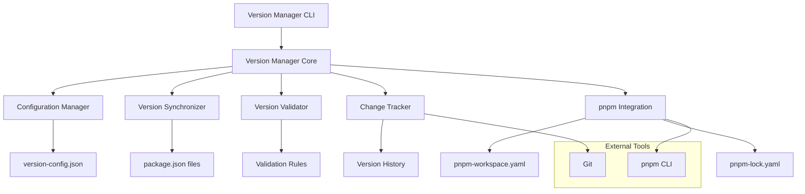

# Design Document

## Overview

版本统一管理系统是一个用于 Vite Enhance Kit 项目的版本管理工具，旨在解决 monorepo 项目中版本不一致的问题。该系统提供中央化的版本管理、自动化的版本同步、以及与 pnpm 工作空间的深度集成。

## Architecture

### 系统架构图



### 核心组件

1. **Version Manager Core**: 核心版本管理引擎
2. **Configuration Manager**: 配置管理器
3. **Version Synchronizer**: 版本同步器
4. **Version Validator**: 版本验证器
5. **Change Tracker**: 变更追踪器
6. **pnpm Integration**: pnpm 集成模块

## Components and Interfaces

### 1. Version Manager Core

```typescript
interface VersionManagerCore {
  // 版本管理操作
  updateVersion(target: string, version: string, options?: UpdateOptions): Promise<UpdateResult>;
  syncVersions(strategy: VersionStrategy): Promise<SyncResult>;
  validateVersions(): Promise<ValidationResult>;
  
  // 配置管理
  loadConfig(): Promise<VersionConfig>;
  saveConfig(config: VersionConfig): Promise<void>;
  
  // 历史管理
  getVersionHistory(): Promise<VersionHistory[]>;
  rollbackVersion(target: string, version: string): Promise<RollbackResult>;
}
```

### 2. Configuration Manager

```typescript
interface ConfigurationManager {
  loadConfig(path?: string): Promise<VersionConfig>;
  validateConfig(config: VersionConfig): ValidationResult;
  mergeConfig(base: VersionConfig, override: Partial<VersionConfig>): VersionConfig;
  getDefaultConfig(): VersionConfig;
}

interface VersionConfig {
  strategy: 'unified' | 'independent';
  packages: PackageConfig[];
  dependencies: DependencyConfig;
  rules: VersionRules;
  integrations: IntegrationConfig;
}
```

### 3. Version Synchronizer

```typescript
interface VersionSynchronizer {
  syncPackageVersions(packages: string[], version: string): Promise<SyncResult>;
  syncDependencyVersions(dependency: string, version: string): Promise<SyncResult>;
  syncWorkspaceDependencies(): Promise<SyncResult>;
  generateSyncPlan(changes: VersionChange[]): SyncPlan;
}

interface SyncResult {
  success: boolean;
  changes: VersionChange[];
  errors: SyncError[];
  warnings: string[];
}
```

### 4. Version Validator

```typescript
interface VersionValidator {
  validateVersion(version: string): ValidationResult;
  validatePackageConsistency(): Promise<ConsistencyResult>;
  validateDependencyCompatibility(): Promise<CompatibilityResult>;
  validateWorkspaceReferences(): Promise<ReferenceResult>;
}

interface ValidationResult {
  valid: boolean;
  errors: ValidationError[];
  warnings: string[];
}
```

### 5. Change Tracker

```typescript
interface ChangeTracker {
  recordChange(change: VersionChange): Promise<void>;
  getChangeHistory(filter?: HistoryFilter): Promise<VersionHistory[]>;
  generateChangeReport(from: string, to: string): Promise<ChangeReport>;
  createGitTag(version: string, message?: string): Promise<void>;
}

interface VersionChange {
  timestamp: Date;
  type: 'version' | 'dependency';
  target: string;
  from: string;
  to: string;
  reason: string;
}
```

### 6. pnpm Integration

```typescript
interface PnpmIntegration {
  getWorkspacePackages(): Promise<WorkspacePackage[]>;
  updateLockFile(): Promise<void>;
  installDependencies(): Promise<void>;
  validateWorkspaceConfig(): Promise<ValidationResult>;
}

interface WorkspacePackage {
  name: string;
  path: string;
  version: string;
  dependencies: Record<string, string>;
  devDependencies: Record<string, string>;
}
```

## Data Models

### 版本配置模型

```typescript
interface VersionConfig {
  // 版本策略
  strategy: 'unified' | 'independent';
  
  // 包配置
  packages: {
    include: string[];
    exclude: string[];
    groups: PackageGroup[];
  };
  
  // 依赖配置
  dependencies: {
    unified: Record<string, string>;
    ranges: Record<string, string>;
    pinned: string[];
  };
  
  // 版本规则
  rules: {
    format: string; // semver format
    prerelease: {
      enabled: boolean;
      identifiers: string[];
    };
    increment: {
      major: string[];
      minor: string[];
      patch: string[];
    };
  };
  
  // 集成配置
  integrations: {
    git: {
      enabled: boolean;
      tagPrefix: string;
      commitMessage: string;
    };
    pnpm: {
      updateLock: boolean;
      install: boolean;
    };
  };
}

interface PackageGroup {
  name: string;
  packages: string[];
  strategy: 'unified' | 'independent';
  versionPrefix?: string;
}
```

### 版本历史模型

```typescript
interface VersionHistory {
  id: string;
  timestamp: Date;
  version: string;
  changes: VersionChange[];
  author: string;
  message: string;
  gitCommit?: string;
  gitTag?: string;
}

interface VersionChange {
  type: 'package' | 'dependency';
  name: string;
  from: string;
  to: string;
  path: string;
}
```

## Correctness Properties

*A property is a characteristic or behavior that should hold true across all valid executions of a system-essentially, a formal statement about what the system should do. Properties serve as the bridge between human-readable specifications and machine-verifiable correctness guarantees.*

### Property-Based Testing Overview

Property-based testing (PBT) validates software correctness by testing universal properties across many generated inputs. Each property is a formal specification that should hold for all valid inputs.

### Core Principles

1. **Universal Quantification**: Every property must contain an explicit "for all" statement
2. **Requirements Traceability**: Each property must reference the requirements it validates
3. **Executable Specifications**: Properties must be implementable as automated tests
4. **Comprehensive Coverage**: Properties should cover all testable acceptance criteria

### Correctness Properties

基于 prework 分析，以下是从接受标准转换而来的可测试属性：

#### Property 1: 配置文件一致性
*For any* version manager instance, the central configuration file should always exist and be in valid JSON format
**Validates: Requirements 1.1**

#### Property 2: 版本更新传播
*For any* version update operation, all related packages should be updated to the same version when using unified strategy
**Validates: Requirements 1.2**

#### Property 3: Semver 格式验证
*For any* version string, the system should correctly identify whether it conforms to semantic versioning specification
**Validates: Requirements 1.3**

#### Property 4: 无效版本拒绝
*For any* invalid version format input, the system should reject the update and provide clear error messages
**Validates: Requirements 1.4**

#### Property 5: 版本更新日志生成
*For any* version update operation, the system should generate a corresponding log entry
**Validates: Requirements 1.5**

#### Property 6: 依赖版本一致性
*For any* dependency used across multiple packages, all instances should maintain the same version in the unified dependency list
**Validates: Requirements 2.1**

#### Property 7: 依赖兼容性检查
*For any* new dependency addition, the system should validate compatibility with existing dependencies
**Validates: Requirements 2.2**

#### Property 8: 依赖版本同步
*For any* dependency version update, all packages using that dependency should be synchronized to the new version
**Validates: Requirements 2.3**

#### Property 9: 冲突解决建议
*For any* detected version conflict, the system should provide actionable resolution suggestions
**Validates: Requirements 2.4**

#### Property 10: 版本范围处理
*For any* version range specification, the system should correctly parse and validate the range format
**Validates: Requirements 2.5**

#### Property 11: 版本一致性检查
*For any* version consistency check command, the system should correctly identify and report inconsistencies
**Validates: Requirements 3.2**

#### Property 12: 批量更新操作
*For any* batch version update operation, all specified packages should be updated atomically
**Validates: Requirements 3.3**

#### Property 13: 错误退出码
*For any* version inconsistency detection, the CLI should return a non-zero exit code
**Validates: Requirements 3.4**

#### Property 14: 干运行模式
*For any* dry-run operation, the system should show planned changes without executing them
**Validates: Requirements 3.5**

#### Property 15: 统一版本策略
*For any* unified version strategy configuration, all packages should maintain the same version
**Validates: Requirements 4.1, 4.3**

#### Property 16: 独立版本策略
*For any* independent version strategy configuration, packages can have different versions while maintaining compatibility
**Validates: Requirements 4.2, 4.4**

#### Property 17: 版本策略配置
*For any* version strategy rule configuration, the system should apply the rules correctly
**Validates: Requirements 4.5**

#### Property 18: 工作空间依赖识别
*For any* workspace configuration, the system should correctly identify all internal dependencies
**Validates: Requirements 5.1**

#### Property 19: 依赖引用更新
*For any* package version update, all references to that package should be updated accordingly
**Validates: Requirements 5.2**

#### Property 20: Workspace 引用验证
*For any* workspace:* reference, the system should validate that the referenced package exists
**Validates: Requirements 5.3**

#### Property 21: 依赖不匹配修复
*For any* internal dependency version mismatch, the system should provide specific fix suggestions
**Validates: Requirements 5.4**

#### Property 22: 依赖图可视化
*For any* workspace dependency structure, the generated dependency graph should accurately reflect the relationships
**Validates: Requirements 5.5**

#### Property 23: 版本历史记录
*For any* version change operation, the system should create a complete history record
**Validates: Requirements 6.1**

#### Property 24: 变更报告生成
*For any* version update execution, the system should generate a comprehensive change report
**Validates: Requirements 6.2**

#### Property 25: 版本差异比较
*For any* two version states, the system should accurately identify and display the differences
**Validates: Requirements 6.3**

#### Property 26: 版本回滚功能
*For any* version rollback operation, the system should restore the previous version state correctly
**Validates: Requirements 6.4**

#### Property 27: Git 标签集成
*For any* version release, the system should create appropriate Git tags when enabled
**Validates: Requirements 6.5**

#### Property 28: pnpm 工作空间支持
*For any* pnpm workspace configuration, the system should correctly parse and utilize the workspace settings
**Validates: Requirements 7.1**

#### Property 29: 锁文件一致性
*For any* version update operation, the pnpm-lock.yaml should remain consistent with package.json changes
**Validates: Requirements 7.2**

#### Property 30: pnpm 依赖解析
*For any* dependency resolution, the system should leverage pnpm's resolution mechanism
**Validates: Requirements 7.3**

#### Property 31: pnpm 版本范围语法
*For any* pnpm version range syntax, the system should correctly interpret and process it
**Validates: Requirements 7.4**

#### Property 32: pnpm 命令兼容性
*For any* version management operation, the system should remain compatible with pnpm commands
**Validates: Requirements 7.5**

#### Property 33: 配置规则应用
*For any* configuration file with version rules, the system should apply the rules correctly
**Validates: Requirements 8.1, 8.2**

#### Property 34: 版本格式配置
*For any* version prefix and suffix configuration, the system should apply the formatting correctly
**Validates: Requirements 8.3**

#### Property 35: 预发布版本管理
*For any* prerelease version operation, the system should handle prerelease identifiers correctly
**Validates: Requirements 8.4**

#### Property 36: 配置验证
*For any* configuration file, the system should validate the configuration and report errors for invalid settings
**Validates: Requirements 8.5**

## Error Handling

### 错误分类

1. **配置错误**: 无效的配置文件格式或内容
2. **版本格式错误**: 不符合 semver 规范的版本号
3. **依赖冲突错误**: 不兼容的依赖版本组合
4. **文件系统错误**: 无法读写 package.json 或配置文件
5. **Git 集成错误**: Git 操作失败
6. **pnpm 集成错误**: pnpm 命令执行失败

### 错误处理策略

```typescript
interface ErrorHandler {
  handleConfigError(error: ConfigError): ErrorResponse;
  handleVersionError(error: VersionError): ErrorResponse;
  handleDependencyError(error: DependencyError): ErrorResponse;
  handleFileSystemError(error: FileSystemError): ErrorResponse;
  handleGitError(error: GitError): ErrorResponse;
  handlePnpmError(error: PnpmError): ErrorResponse;
}

interface ErrorResponse {
  code: string;
  message: string;
  suggestions: string[];
  recoverable: boolean;
}
```

## Testing Strategy

### 双重测试方法

- **单元测试**: 验证特定示例、边界情况和错误条件
- **属性测试**: 验证跨所有输入的通用属性
- 两者互补，对于全面覆盖都是必要的

### 单元测试重点

- 配置文件解析和验证
- 版本格式验证
- 依赖冲突检测
- Git 和 pnpm 集成点
- 错误处理和恢复

### 属性测试配置

- 每个属性测试最少运行 100 次迭代
- 每个属性测试必须引用其设计文档属性
- 标签格式: **Feature: version-management, Property {number}: {property_text}**

### 测试数据生成

```typescript
// 版本号生成器
const versionGenerator = fc.record({
  major: fc.nat(100),
  minor: fc.nat(100),
  patch: fc.nat(100),
  prerelease: fc.option(fc.string()),
}).map(({major, minor, patch, prerelease}) => 
  `${major}.${minor}.${patch}${prerelease ? `-${prerelease}` : ''}`
);

// 包配置生成器
const packageConfigGenerator = fc.record({
  name: fc.string().filter(s => s.length > 0),
  version: versionGenerator,
  dependencies: fc.dictionary(fc.string(), versionGenerator),
});

// 工作空间配置生成器
const workspaceConfigGenerator = fc.record({
  packages: fc.array(fc.string()),
  strategy: fc.constantFrom('unified', 'independent'),
});
```