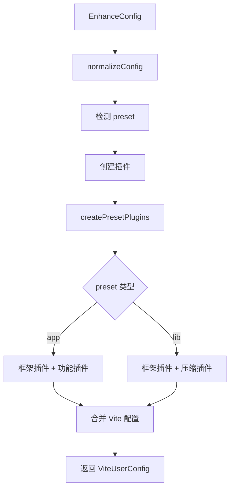

# Vite Enhance 包完整分析报告

## 📋 概述

**vite-enhance** 是一个基于 Vite 的工程化增强工具包，提供智能项目识别、统一构建模型和企业级能力。它不替代 Vite，而是作为增强层，让 Vite 在真实项目中更好用、更统一、更可治理。

### 核心定位

- **定位**: Vite 工程化增强层
- **适用**: Vue / React / Svelte / Solid / Lit / Preact 应用 & 组件库
- **风格**: 约定优于配置、渐进增强
- **特性**: 类型安全、插件化、可扩展

---

## 🏗️ 架构设计

### 1. 目录结构

```
packages/vite-enhance/
├── src/
│   ├── config/              # 配置系统
│   │   ├── defaults.ts      # 默认配置
│   │   ├── index.ts         # 配置入口
│   │   ├── schema.ts        # Zod 配置验证
│   │   ├── validator.ts     # 配置验证器
│   │   ├── vite-integration.ts        # Vite 集成核心
│   │   ├── vite-integration-helpers.ts # 集成辅助函数
│   │   └── vite-integration-utils.ts   # 集成工具函数
│   ├── plugins/             # 插件系统
│   │   ├── analyze/         # 构建分析插件
│   │   ├── cache/           # 构建缓存插件
│   │   ├── cdn/             # CDN 外部化插件
│   │   ├── compress/        # 压缩打包插件
│   │   ├── framework-vue/   # Vue 框架插件
│   │   ├── framework-react/ # React 框架插件
│   │   └── pwa/             # PWA 支持插件
│   ├── shared/              # 共享模块
│   │   ├── types/           # TypeScript 类型定义
│   │   │   ├── config.ts    # 配置类型
│   │   │   ├── plugin.ts    # 插件类型
│   │   │   └── hooks.ts     # 钩子类型
│   │   ├── index.ts         # 共享模块入口
│   │   └── logger.ts        # 日志工具
│   └── index.ts             # 主入口文件
├── dist/                    # 编译输出
├── package.json
├── tsconfig.json
└── README.md
```

---

## 🔧 核心系统

### 1. 配置系统 (Config System)

#### 1.1 配置结构

```typescript
interface EnhanceConfig {
  // 嵌套配置结构
  enhance?: {
    preset?: 'app' | 'lib' | PresetConfig;
    
    // 框架配置
    vue?: VuePluginOptions | boolean;
    react?: ReactPluginOptions | boolean;
    svelte?: SveltePluginOptions | boolean;
    solid?: SolidPluginOptions | boolean;
    lit?: LitPluginOptions | boolean;
    preact?: PreactPluginOptions | boolean;
    
    // 功能配置
    cdn?: CDNOptions | boolean;
    cache?: CacheOptions | boolean;
    analyze?: AnalyzeOptions | boolean;
    pwa?: PWAOptions | boolean;
    compress?: CompressOptions | boolean;
  };
  
  // Vite 原生配置
  vite?: ViteUserConfig;
  
  // 额外插件
  plugins?: any[];
}
```

#### 1.2 配置验证

使用 **Zod** 进行配置验证：

```typescript
// schema.ts
export const EnhanceConfigSchema = z.object({
  preset: z.union([
    z.literal('app'),
    z.literal('lib'),
    PresetConfigSchema,
  ]).optional().nullable(),
  
  plugins: z.array(
    z.union([z.string(), EnhancePluginSchema])
  ).optional().nullable(),
  
  vite: z.record(z.string(), z.unknown()).optional().nullable(),
  
  // 框架和功能配置...
});
```

#### 1.3 默认配置

```typescript
export const defaultConfig: Partial<EnhanceConfig> = {
  enhance: {
    preset: 'app',
    cdn: false,
    cache: true,
    analyze: false,
    pwa: false,
    compress: true,
  },
  plugins: [],
};
```

#### 1.4 智能检测

**框架检测** (`detectFramework`):
- 检查显式配置
- 扫描 package.json 依赖
- 支持: Vue, React, Svelte, Solid, Lit, Preact

**预设检测** (`detectPreset`):
- 检查 package.json 的 main/module/types 字段
- 检查构建脚本 (build:lib, build:esm 等)
- 检查依赖 (rollup, vite-plugin-dts 等)
- 检查 HTML 入口文件
- 检查目录结构 (public, assets 等)

---

### 2. 插件系统 (Plugin System)

#### 2.1 插件接口

```typescript
interface EnhancePlugin {
  name: string;
  version?: string;
  enforce?: 'pre' | 'post';
  apply?: 'serve' | 'build' | 'both';
  
  // 生命周期钩子
  configResolved?: (config: ResolvedEnhanceConfig) => void | Promise<void>;
  buildStart?: (context: BuildContext) => void | Promise<void>;
  buildEnd?: (context: BuildContext) => void | Promise<void>;
  configureServer?: (server: ViteDevServer) => void | Promise<void>;
  
  // 返回 Vite 插件
  vitePlugin?: () => VitePlugin | VitePlugin[];
}
```

#### 2.2 官方插件

##### 2.2.1 框架插件

**Vue 插件** (`enhance:framework-vue`):
- 集成 `@vitejs/plugin-vue`
- 支持 Vue 3 SFC 编译
- 集成 Vue DevTools
- 支持组件检查器
- 可配置编辑器启动

**React 插件** (`enhance:framework-react`):
- 集成 `@vitejs/plugin-react`
- 支持 Fast Refresh
- 自动 JSX 转换

##### 2.2.2 功能插件

**CDN 插件** (`enhance:cdn`):
- 自动检测依赖
- 支持多个 CDN 提供商 (jsdelivr, unpkg, cdnjs)
- 内置常用库配置 (React, Vue, Lodash, Axios 等)
- 自动生成 script/link 标签
- 生成 CDN 清单文件

**缓存插件** (`enhance:cache`):
- 基于文件哈希的智能缓存
- 支持模式匹配 (include/exclude)
- 缓存清单管理
- 性能优化 (哈希缓存、模式缓存)
- 自动清理过期缓存

**分析插件** (`enhance:analyze`):
- 集成 `rollup-plugin-visualizer`
- 构建性能指标输出
- 插件耗时分析
- 支持多种可视化模板 (treemap, sunburst, network)
- 生成 HTML 和 JSON 报告

**PWA 插件** (`enhance:pwa`):
- 集成 `vite-plugin-pwa`
- Service Worker 生成
- Web App Manifest 配置
- 自动更新支持

**压缩插件** (`enhance:compress`):
- 支持多种格式 (tar, tar.gz, zip)
- 库构建压缩控制
- 新增 `disableForLib` 选项
- 新增 `appOnly` 选项
- 构建产物大小统计
- 智能日志输出

---

### 3. Vite 集成 (Vite Integration)

#### 3.1 配置转换流程



#### 3.2 核心函数

**`defineEnhanceConfig`**:
- 主配置函数
- 转换 EnhanceConfig 为 ViteUserConfig
- 附加原始配置供 CLI 使用

**`createViteConfig`**:
- 创建 Vite 配置
- 设置输出目录
- 合并插件

**`normalizeConfig`**:
- 规范化配置结构
- 支持嵌套和扁平结构
- 自动检测 preset

**`createEnhancePlugins`**:
- 创建增强插件列表
- 根据 preset 选择插件

**`createPresetPlugins`**:
- 根据 preset 创建插件
- app: 框架 + 功能插件
- lib: 框架 + 压缩 + 分析插件

---

## 🎯 核心功能

### 1. 智能识别

#### 1.1 框架自动检测
- 扫描 package.json 依赖
- 支持 6 种主流框架
- 自动加载对应插件

#### 1.2 项目类型检测
- 应用 (App): 有 HTML 入口、dev 脚本
- 库 (Lib): 有 main/module/types 字段、构建脚本

### 2. 统一构建模型

#### 2.1 应用构建 (App Preset)
- 框架插件自动加载
- CDN 外部化
- 构建缓存
- 包分析
- PWA 支持

#### 2.2 库构建 (Lib Preset)
- 框架插件支持
- 压缩打包
- 类型定义生成
- 多格式输出

### 3. 企业级能力

#### 3.1 CDN 支持
- 自动检测依赖
- 支持内网 CDN
- 自定义 URL 模板
- 生成资源清单

#### 3.2 构建缓存
- 文件哈希缓存
- 智能失效机制
- 性能优化
- 缓存清理

#### 3.3 构建分析
- 包大小可视化
- 插件耗时统计
- 多种报告格式
- 性能指标输出

---

## 🆕 新增功能

### 1. 库构建压缩控制

为库构建添加了灵活的压缩控制选项，允许开发者在构建库时禁用压缩功能，生成未压缩的代码用于调试和源码查看。

### 2. 构建输出目录优化

根据项目类型智能管理构建输出目录：
- **库构建 (Lib)**: 直接输出到 `dist` 目录，简化目录结构
- **应用构建 (App)**: 输出到 `dist/包名` 目录，避免多项目冲突

---

## 🆕 新增功能详解

### 功能 1: 库构建压缩控制

### 功能 1: 库构建压缩控制

#### 功能概述

为库构建添加了灵活的压缩控制选项，允许开发者在构建库时禁用压缩功能，生成未压缩的代码用于调试和源码查看。

### 配置选项

```typescript
interface CompressOptions {
  format?: 'tar' | 'tar.gz' | 'zip';
  outputDir?: string;
  enabled?: boolean;
  fileName?: string;
  
  // 新增选项
  disableForLib?: boolean;  // 库构建时禁用压缩
  appOnly?: boolean;        // 仅应用构建时启用压缩
}
```

### 使用示例

```typescript
// 库构建时禁用压缩
export default defineConfig(
  defineEnhanceConfig({
    enhance: {
      preset: 'lib',
      compress: {
        disableForLib: true,
        format: 'tar.gz'
      }
    }
  })
)

// 仅应用构建时启用压缩
export default defineConfig(
  defineEnhanceConfig({
    enhance: {
      compress: {
        appOnly: true
      }
    }
  })
)
```

### 决策逻辑

```typescript
function shouldEnableCompressionForLib(compressConfig: any): boolean {
  // 1. 完全禁用
  if (compressConfig === false) return false;
  
  // 2. 对象配置
  if (typeof compressConfig === 'object') {
    if (compressConfig.disableForLib === true) return false;
    if (compressConfig.appOnly === true) return false;
    if (compressConfig.enabled === false) return false;
  }
  
  // 3. 默认启用
  return true;
}
```

### 日志输出

- 压缩状态日志
- 构建类型检测
- 配置冲突警告
- 构建产物大小信息

---

### 功能 2: 构建输出目录优化与默认配置

#### 功能概述

根据项目类型（App 或 Lib）智能管理构建输出目录，并为库构建提供开箱即用的默认配置，简化库开发流程。

#### 默认库构建配置

当 `preset` 为 `lib` 时，自动提供以下默认配置：

```typescript
{
  build: {
    outDir: 'dist',
    lib: {
      entry: 'src/index.ts',
      name: packageName,  // 从 package.json 读取
      formats: ['es', 'cjs'],
      fileName: (format) => `index.${format === 'es' ? 'mjs' : 'cjs'}`
    }
  }
}
```

#### 目录结构

**库构建 (Lib Preset)**:
```
项目根目录/
└── dist/              # 直接输出到 dist 目录
    ├── index.mjs      # ES Module 格式
    └── index.cjs      # CommonJS 格式
```

**应用构建 (App Preset)**:
```
项目根目录/
└── dist/
    └── 包名/          # 输出到 dist/包名 目录
        ├── index.html
        └── assets/
            └── *.js
```

#### 实现逻辑

```typescript
/**
 * 获取默认的库构建配置
 */
function getDefaultLibConfig() {
  const packageName = getPackageName();
  
  return {
    entry: 'src/index.ts',
    name: packageName,
    formats: ['es', 'cjs'] as const,
    fileName: (format: string) => `index.${format === 'es' ? 'mjs' : 'cjs'}`
  };
}

/**
 * 获取构建输出目录
 */
function getBuildOutDir(preset: string | { name: string } | undefined): string {
  const presetName = typeof preset === 'string' ? preset : preset?.name;
  
  // 库构建直接输出到 dist 目录
  if (presetName === 'lib') {
    return 'dist';
  }
  
  // 应用构建输出到 dist/包名 目录
  const packageName = getPackageName();
  return `dist/${packageName}`;
}

/**
 * 创建 Vite 配置
 */
export function createViteConfig(config: EnhanceConfig): ViteUserConfig {
  const normalizedConfig = normalizeConfig(config);
  const outDir = getBuildOutDir(normalizedConfig.preset);
  const isLibBuild = normalizedConfig.preset === 'lib';
  
  const buildConfig: any = {
    ...config.vite?.build,
    outDir: config.vite?.build?.outDir || outDir,
  };
  
  // 为库构建提供默认配置
  if (isLibBuild) {
    if (!config.vite?.build?.lib) {
      // 用户未配置，使用默认配置
      buildConfig.lib = getDefaultLibConfig();
    } else {
      // 用户配置了，合并默认配置（用户配置优先）
      const defaultLib = getDefaultLibConfig();
      buildConfig.lib = {
        ...defaultLib,
        ...config.vite.build.lib,
      };
    }
  }
  
  return {
    ...config.vite,
    build: buildConfig,
    plugins: [...],
  };
}
```

#### 配置优先级

1. **用户配置优先**: 用户提供的配置会覆盖默认配置
2. **智能合并**: 默认配置与用户配置合并
3. **完全自定义**: 支持完全自定义所有选项

#### 使用示例

**最简配置**（使用所有默认值）:
```typescript
export default defineConfig(
  defineEnhanceConfig({
    enhance: {
      preset: 'lib'
    }
  })
)
// 输出: dist/index.mjs, dist/index.cjs
```

**部分自定义**:
```typescript
export default defineConfig(
  defineEnhanceConfig({
    enhance: {
      preset: 'lib'
    },
    vite: {
      build: {
        lib: {
          entry: 'src/main.ts',  // 只自定义入口
          // 其他使用默认值
        }
      }
    }
  })
)
```

**完全自定义**:
```typescript
export default defineConfig(
  defineEnhanceConfig({
    enhance: {
      preset: 'lib'
    },
    vite: {
      build: {
        lib: {
          entry: 'src/main.ts',
          name: 'MyLib',
          formats: ['es', 'umd'],
          fileName: 'custom'
        }
      }
    }
  })
)
// 输出: dist/custom.js, dist/custom.umd.cjs
```

#### 优势

1. **开箱即用**: 库构建无需任何配置即可工作
2. **符合约定**: 默认配置符合现代库开发的最佳实践
3. **灵活性**: 支持部分或完全自定义配置
4. **简化配置**: 减少样板代码，提高开发效率
5. **智能合并**: 用户配置与默认配置智能合并
6. **应用隔离**: 应用构建输出到 `dist/包名`，避免多项目冲突
7. **向后兼容**: 不影响现有配置的行为

---

## 📊 技术栈

### 核心依赖

- **Vite**: ^7.3.0 - 构建工具
- **TypeScript**: ^5.9.3 - 类型系统
- **Zod**: ^4.2.1 - 配置验证

### 框架插件

- **@vitejs/plugin-vue**: ^6.0.3 - Vue 支持
- **@vitejs/plugin-react**: ^5.1.2 - React 支持
- **@sveltejs/vite-plugin-svelte**: ^3.1.2 - Svelte 支持
- **vite-plugin-solid**: ^2.11.0 - Solid 支持
- **@preact/preset-vite**: ^2.8.2 - Preact 支持

### 功能插件

- **vite-plugin-pwa**: ^1.2.0 - PWA 支持
- **rollup-plugin-visualizer**: ^6.0.5 - 构建分析
- **vite-plugin-cdn-import**: ^1.0.1 - CDN 外部化
- **vite-plugin-cache**: ^1.4.8 - 构建缓存
- **vite-plugin-vue-devtools**: ^8.0.5 - Vue DevTools

### 工具库

- **tar**: ^7.4.3 - tar 压缩
- **archiver**: ^7.0.1 - zip 压缩

---

## 🔍 代码质量

### 类型安全

- 完整的 TypeScript 类型定义
- Zod schema 验证
- 严格的类型检查

### 错误处理

- 配置验证错误
- 插件加载失败处理
- 构建错误捕获
- 友好的错误信息

### 性能优化

- 文件哈希缓存
- 模式匹配缓存
- 懒加载插件
- 智能缓存失效

---

## 🚀 使用场景

### 1. 企业级中后台系统
- 统一工程规范
- CDN 外部化
- 构建缓存加速

### 2. 组件库开发
- 库构建模式
- 类型定义生成
- 多格式输出
- 压缩控制

### 3. Monorepo 架构
- 多包管理
- 依赖提升
- 统一构建配置

### 4. PWA 应用
- Service Worker
- 离线支持
- 应用清单

---

## 📈 优势与特点

### 1. 约定优于配置
- 自动检测框架
- 自动检测项目类型
- 智能默认配置

### 2. 渐进增强
- 可选功能插件
- 不破坏现有配置
- 向后兼容

### 3. 类型安全
- 完整类型定义
- 配置验证
- IDE 智能提示

### 4. 插件化架构
- 官方插件生态
- 可扩展性强
- 生命周期钩子

### 5. 企业级能力
- CDN 支持
- 构建缓存
- 性能分析
- PWA 支持

---

## 🔮 未来规划

### Phase 1 · 核心能力（当前）
- ✅ App / Lib 双构建模型
- ✅ 多框架自动识别
- ✅ 官方插件体系
- ✅ CDN（含内网）
- ✅ 库构建压缩控制

### Phase 2 · 工程规模化
- Monorepo 深度支持
- 构建缓存与加速
- 构建可观测性

### Phase 3 · 跨平台工程
- Electron 工程增强
- React Native 工程协同
- Web / Desktop / Mobile 工程统一

---

## 📝 总结

**vite-enhance** 是一个设计精良的 Vite 工程化增强工具包，具有以下核心优势：

1. **智能化**: 自动检测框架和项目类型，减少配置负担
2. **模块化**: 插件化架构，功能可按需启用
3. **类型安全**: 完整的 TypeScript 支持和 Zod 验证
4. **企业级**: CDN、缓存、分析、PWA 等企业级能力
5. **可扩展**: 清晰的插件接口，易于扩展

通过提供统一的配置接口和智能的默认行为，vite-enhance 让 Vite 在真实项目中更好用、更统一、更可治理，是中大型项目和企业级应用的理想选择。

---

**生成时间**: 2026-01-08  
**版本**: 0.2.1  
**分析者**: Kiro AI Assistant